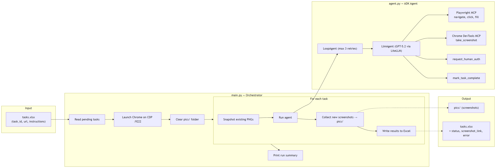

# Tester Agent

Web task automation agent powered by [Google ADK](https://github.com/google/adk-python) with Playwright and Chrome DevTools MCP toolsets.

## What it does

Reads tasks from an Excel spreadsheet (`tasks.xlsx`), launches Chrome, and uses an LLM-driven agent to execute each task on the web. Screenshots are captured after each task and saved to `pics/`. If a website plays audio, the agent can record it and save WAV files to `audio/`. Results (status, screenshot path, audio path, errors) are written back into the spreadsheet.

Key features:

- **Dual MCP toolsets** -- Playwright MCP for browser interaction, Chrome DevTools MCP for screenshots
- **Audio capture** -- records tab audio output as WAV files when the agent detects audio playback
- **Fake microphone input** -- Chrome launches with fake media device flags for mic/camera testing
- **Human-in-the-loop auth** -- pauses for manual login/2FA when detected, then resumes
- **Automatic retry** -- LoopAgent wraps the executor with up to 3 attempts per task
- **Per-task isolation** -- failures on one task don't block the rest

## Architecture



## Setup

Requires Python 3.13+, Node.js (for `npx`), and Chrome installed.

```bash
# Install dependencies
uv sync

# For Vertex AI support, also install the vertex extra
uv sync --extra vertex

# Create .env with your API key
cp .env.example .env
# Edit .env and set your LLM provider + API key
```

## Usage

1. Create a `tasks.xlsx` with columns: `task_id`, `url`, `instructions`. A sample generator is included:

   ```bash
   uv run python create_sample_xlsx.py
   ```

2. Run the agent:

   ```bash
   uv run python main.py
   ```

3. Results are written to `tasks.xlsx` (columns: `screenshot_link`, `audio_link`, `status`, `error`, `explanation`) and screenshots are saved in `pics/`. If the agent captured audio, WAV files are saved in `audio/`.

## Project structure

```
main.py               Orchestrator -- launches Chrome, runs tasks, collects screenshots & audio
agent.py              ADK agent definition (LoopAgent + LlmAgent + 7 tools)
excel_io.py           Read/write task spreadsheets
create_sample_xlsx.py Generate a sample tasks.xlsx
tests/                Unit tests
pics/                 Screenshot output (cleared each run)
audio/                Audio capture output (cleared each run)
docs/plans/           Design and implementation docs
```

## Configuration

| Variable | Description |
|---|---|
| `MODEL_PROVIDER` | LLM provider: `openai` (default), `vertex_ai`, or `google` |
| `MODEL_NAME` | Model name (default: `gpt-5.2`). Examples: `gemini-2.5-flash` |
| `OPENAI_API_KEY` | OpenAI API key (when using `openai` provider) |
| `VERTEXAI_PROJECT` | GCP project ID (when using `vertex_ai` provider) |
| `VERTEXAI_LOCATION` | GCP region, e.g. `us-central1` (when using `vertex_ai` provider) |
| `GOOGLE_API_KEY` | Google AI API key (when using `google` provider) |
| `CHROME_PATH` | Custom Chrome executable path (optional) |
| `FAKE_AUDIO_FILE` | Path to a WAV file for fake mic input (optional -- omit for synthetic beep) |

The model string is built from `MODEL_PROVIDER` / `MODEL_NAME` and routed through ADK's LLMRegistry. For Vertex AI, install the extra: `uv sync --extra vertex`.

## Audio capabilities

**Microphone testing (input):** Chrome is launched with `--use-fake-device-for-media-stream` so `getUserMedia()` works without a real mic. Set `FAKE_AUDIO_FILE` to feed a specific WAV, or leave empty for a synthetic beep. The agent can also call `inject_fake_audio` to dynamically override `getUserMedia` with a Web Audio oscillator tone.

**Tab audio capture (output):** When a task involves a website that plays audio, the agent calls `start_audio_capture` (injects JS that hooks `<audio>`/`<video>` elements via the Web Audio API) and `stop_audio_capture` (encodes captured PCM as WAV). The base64-encoded WAV is passed back through `mark_task_complete` and the orchestrator saves it to `audio/`.
